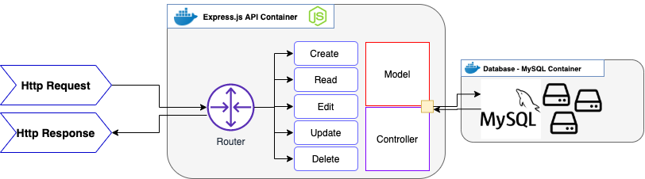

# Node.js MySQL Boilerplate
This repository demonstrates how so spin up a Express/Node.js API and connect it to a MySQL database.
This repository also demonstrate how to setup a docker environment for running the project and build a docker-compose file for spinning up both containers of the project at once using a single docker-compose command. 

The diagram below gives you a general structure overview and how it accepts HTTP requests and responses in order to preform CRUD functionality on our MySQL instance. 



This repo is not intended for production deployment straight off the clone but more so a learning resource. I intend to develop it and provide enough functionality to eventually make it a "GOTO" resource for deploying a architecture like this and explore data replication, pipelines and perhaps even Kubernetes!

---

## API Endpoints

Blow are the methods avaliable to interact with the database through the REST API.
URL Example: localhost:3000/URL

| Method  | Url | Action  |
| :---: | :---: | :---: |
| GET  | /items  | get all Items  |
| GET  | /items/ :id  | get Item by id  |
| POST  | /items  | add new Item  |
| PUT  | /items/ :id  | update Item with id  |
| DELETE  | /items/ :id  | remove item with id  |
| DELETE  | /items  | remove all items  |

---

## Project setup with Docker Locally
```
$ git clone https://github.com/danielruffolodeveloper/Node.js_MySQL_Boilerplate.git node_mysql
$ cd node_mysql
$ docker-compose up -d
```
The project is now running using Docker. You can see the active containers by running docker ps in terminal:
- Node.js: localhost:3000
- MySQL: localhost:3306

You can use a tool such as [MySQL WorkBench] to view the database in a GUI. 

---

## Resources
+ [Docker]: Software containerization platform
+ [node.js]: Server enviroment.
+ [MySQL]: Relational database system.
+ [docker-build]: Automated build of *Docker* images.
+ [docker-compose]: Automated configuration and run of multi-container *Docker* applications.

[Microservices architecture]: http://microservices.io/patterns/microservices.html
[node image]: https://hub.docker.com/_/node/
[mongo image]: https://hub.docker.com/_/mongo/
[node.js]: http://nodejs.org
[Docker]: https://docs.docker.com/
[docker-compose]:https://docs.docker.com/compose/compose-file/
[docker-build]:https://docs.docker.com/engine/reference/builder/
[MySQL]:https://www.mysql.com/
[MySQL WorkBench]:https://www.mysql.com/products/workbench/

